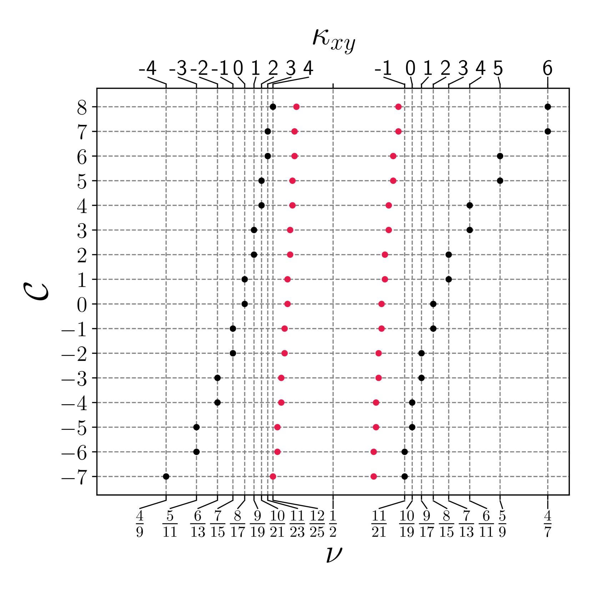

# Identifying the topological order of quantized half-filled Landau levels through their daughter states

This repo contains a Mathematica notebook with calculations of Abelian states properties
from the paper 
"[Identifying the topological order of quantized half-filled Landau levels through their daughter states](https://arxiv.org/abs/2405.03780)" 
by Evgenii Zheltonozhskii, Ady Stern, and Netanel Lindner. 



To cite the paper use the following bibtex:
```
@article{zheltonozhskii2021identifying,
  title={Identifying the topological order of quantized half-filled Landau levels through their daughter states},
  author={Zheltonozhskii, Evgenii and Stern, Ady and Lindner, Netanel},
  year = 2024,
  month = may,
  journal = {arXiv preprint},
  url = {https://arxiv.org/abs/2405.03780},
  eprint = {2405.03780},
  archiveprefix = {arXiv},
  primaryclass = {cond-mat.mes-hall}
}
```